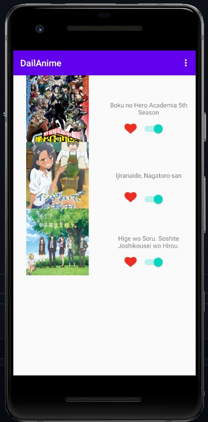

# DailAnime - David HOUSSIAN - Programmation Mobile UFA3A 32A

Cette application permet d'enregistrer vos animés vu au fur est à mesure.
Elle utilise l'API JikanAPI qui est une API REST faisant des requetes au sites MyAnimeList : https://myanimelist.net/

L'application a donc comme fonctionnalitées : 

- Affiché une liste d'elements a l'aide d'un RecyclerView
- D'utiliser une API Rest afin de recuperer des données
- Affiché le details d'un des éléments de la liste
- Stocker des données en format JSON
- L'utilisation de Singletons

# Fonctionnement

On arrive directement sur une liste d'animés 

A partir de la on peut soit cocher les animés que l'on a deja vu soit aller dans sa Watch_List soit les animés que l'on a 
dêja vu ou bien cliquer sur un animé pour voir le resumé et d'autres informations. 

Cocher des animés deja vu : 

Aller dans sa Watch List : 

Cliquer sur un anime :

Lorsque que l'on coche la case pour ajouté un animé a sa liste celle si est directement stocker et apparaitra lorsque l'on ira dans sa Watch_list 
Depuis la Watch List on peu supprimé des animés de la Watch List ou bien encore cliquer sur l'un des animés afin de voir encore le resumés et autres informations de celle-ci.

Suppression d'un animé de sa Watch_List :

Avant :

Après :

